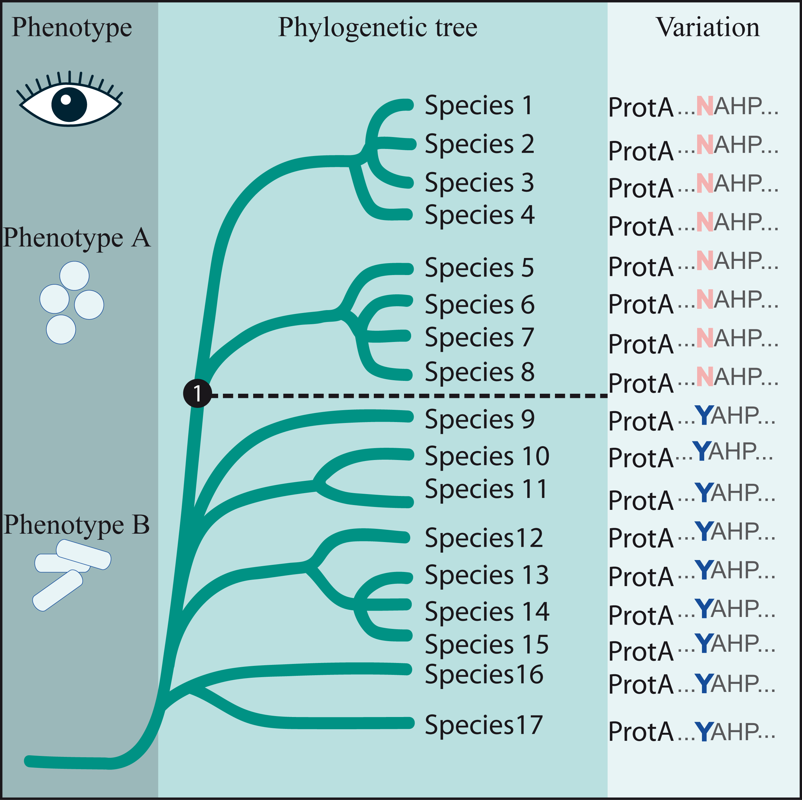

 

# Bioinformatics Tool for Comparative Analyses of Proteins In Bacteria

## What is CAPRIB ?

CAPRIB efficiently finds through an easy-to-use graphical interface amino-acid changes that are strictly associated to the emergence of a phenotype. By comparing two groups of related species separated by a phenotypic switch, this program can pinpoint the evolutionary events, at the genus scale, that led to this transition. This tool, whose core is in Java, uses a relational database in SQL to store raw information, allowing users to quickly change the structure of groups and save projects. In order to help users decipher the impact of mutations, CAPRIB integrates statistical values (Grantham's distance and exchangeability score) that indicate the potential impact of one amino acid change for another. It is also possible to put in relation the detected mutations and the Conserved Domain Database (CDD) in order to have an insight on the structural involvements of the mutations. 



## Dependencies
- [Java](https://www.java.com/fr/download/help/index_installing.xml) 
- [Perl](https://www.activestate.com/activeperl/downloads) 
- [Xampp](https://www.apachefriends.org/index.html ) (Windows and Linux: 7.3.0-0; MacOS: 5.6.39)
- [Blast+](https://www.ncbi.nlm.nih.gov/books/NBK52637/)

## Supported on
- UNIX-like operating systems
- Ms Windows

## CAPRIB through the provided virtual machine
In order to facilitate the use of CAPRIB, we provide a virtual machine running Ubuntu 18.04 LTS, with CAPRIB and its dependencies installed. The databases used to describe CAPRIB in the submitted manuscript (<i>M. tuberculosis</i> H37Rv and <i>M. gilvum</i> Spyr1) are also available directly through the virtual machine. The virtual machine can be downloaded by clicking [here](http://fveyrier.profs.inrs.ca/Download/CAPRIB-V1.ova)  (14.71 Go)
The password accound is: password_01!

Once the virtual machine is installed and started, you must open a terminal, by clicking on the corresponding icon in the left menu, as in the following image.


Once the terminal is open, you can start xampp with the following command:
```sh
sudo /opt/lampp/manager-linux-x64.run
```
After entering the password (password_01!), the xampp window will open, allowing you to start the processes.


You are now ready to start CAPRIB. To do this, you must go to the Caprib directory on the desktop with your device. The following command may allow you this action (from a fresh terminal):
```sh
cd Desktop/Caprib
```
You can finally run the java application:
```sh
java -jar Caprib2019.jar
```

You can now browse CAPRIB and do your analyzes. 


For a detailed tutorial, click [here](http://fveyrier.profs.inrs.ca/Download/tutorial/index.html).

## How to cite CAPRIB
>A manuscript describing CAPRIB and its use is currently submitted. When the manuscript is accepted, we will update this section. For now, if you use CAPRIB, please quote this GitHub.
## License
>CapriB
>Copyright (C) 2019  Juan Guerra, Antony T. Vincent, Martin Chenal, Frederic Veyrier
>This program is free software: you can redistribute it and/or modify
>it under the terms of the GNU General Public License as published by
>the Free Software Foundation, either version 3 of the License, or
>(at your option) any later version.
>This program is distributed in the hope that it will be useful,
>but WITHOUT ANY WARRANTY; without even the implied warranty of
>MERCHANTABILITY or FITNESS FOR A PARTICULAR PURPOSE.  See the
>GNU General Public License for more details.
>You should have received a copy of the GNU General Public License
>along with this program.  If not, see http://www.gnu.org/licenses/.

